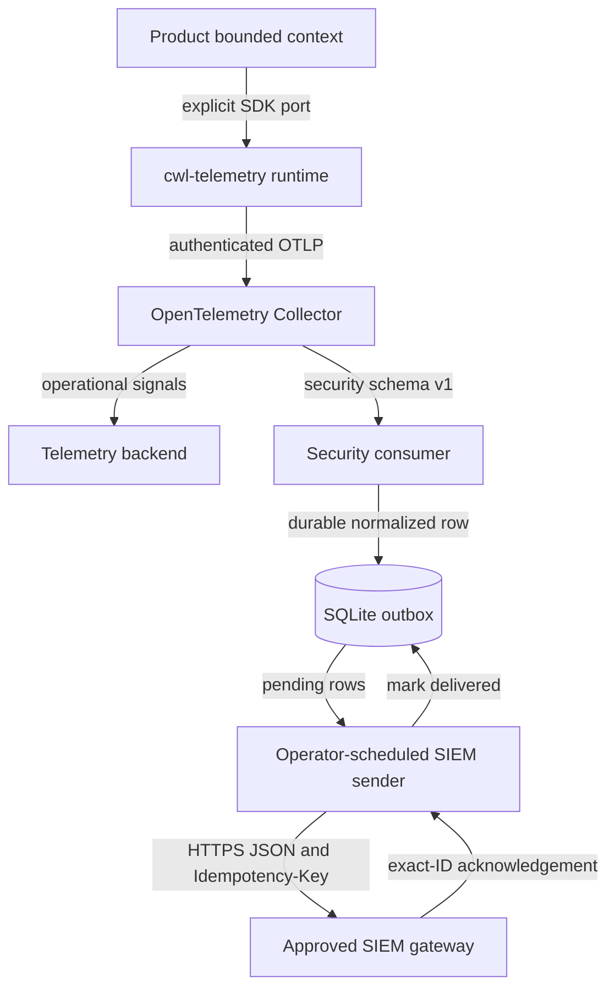
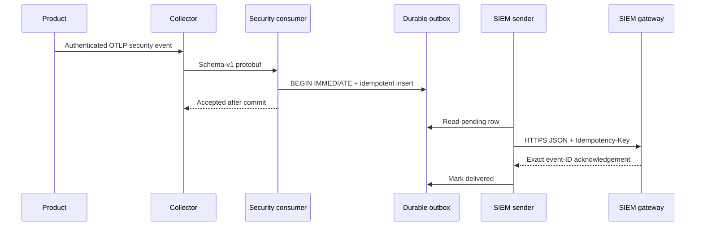
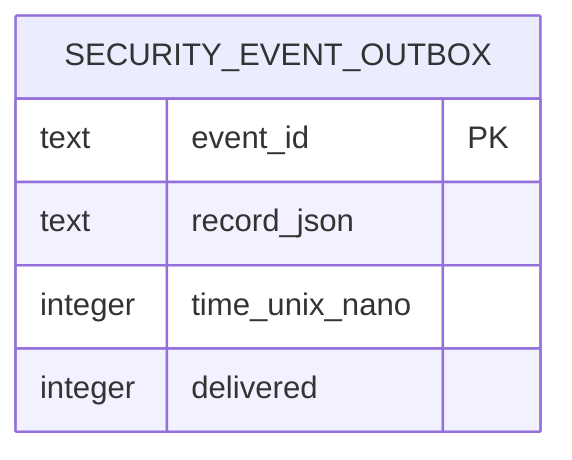

# Product and Technical Gap Baseline

Status: Proposed

Implementation evidence: successor TDD repair on PR #1; immutable exact head is recorded in the PR after publication

Last reviewed predecessor head: `ab81a4d4d7b0754ec1064c2862a2fe27b69338b5`

Release state: no immutable release; consumers must not adopt this branch

This baseline records what `cwl-telemetry` owns, what the current evidence
proves, and what still blocks a production release. Open PR evidence is
provisional. A passing check applies only to the exact head it evaluated.

## PRD: product goal and acceptance boundary

`cwl-telemetry` is the optional canonical owner of explicit OpenTelemetry SDK
bootstrap, bounded telemetry fields, and the Collector routing contract shared
by ContextualWisdomLab products. Products retain their domain truth,
authorization, authoritative audit outbox, credential rotation, and deployment
decisions.

A release candidate is acceptable only when:

1. importing the package creates no provider, thread, or network traffic;
2. product code explicitly bootstraps a bounded trace, metric, and log runtime;
3. authenticated OTLP separates operational and normalized security records;
4. security records remain durable and idempotent until an exact SIEM
   acknowledgement;
5. the exact protected-main revision passes contract, SAST, dependency, and
   CodeQL gates plus independent review;
6. immutable artifacts, hashes, schema evidence, and a consumer parity test are
   published before any consumer enables the integration.

## TRD: current evidence

| Requirement | Exact evidence | Status |
| --- | --- | --- |
| Explicit, inert bootstrap | `src/cwl_telemetry/__init__.py`; `tests/test_contract.py` | Implemented in Proposed PR |
| Finite field and security-event vocabulary | `TelemetryConfig`, `TelemetryEvent`, `validate_event` | Implemented in Proposed PR |
| Authenticated TLS OTLP ingress and route separation | `collector/production.yaml`; pinned real-Collector tests | Implemented; deployment unverified |
| Tenant-bound normalized security projection | `decode_security_export`; hostile-record tests | Implemented in Proposed PR |
| Durable idempotency and exact acknowledgement | `security_event_outbox`; `deliver_pending`; failure-injection tests | Implemented in Proposed PR |
| Bounded OTLP record and batch size | 128-character event-name admission; inherited TraceState removal; real pinned-encoder burst test for 16-record log/trace batches; Telemetry contract run `36824849414` passed on `88d3fda...` | Hosted implementation evidence GREEN; documentation-only successor recheck required |
| Wire-safe counter totals | signed-int64 increment and canonical label-series cumulative admission with repeated-handle and concurrency tests against the pinned metric encoder; Telemetry contract run `36824849414` passed on `88d3fda...` | Hosted implementation evidence GREEN; documentation-only successor recheck required |
| TLS 1.2 minimum on synthetic HTTPS peers | Implementation commit `9da68ea...`; security decoder tests: 8 passed | Repaired; successor exact-head CodeQL recheck required |
| Package completeness | Telemetry contract run `36824849414` on `88d3fda...` ran the locked build, produced wheel and sdist, and verified the packaged `collector/production.yaml` | Hosted implementation evidence GREEN; immutable release still absent |
| Release and consumer adoption | no published release; Naruon migration remains external | Blocked |

The runtime is Python because the supported OpenTelemetry SDK/exporter surface
is the interoperability boundary. It contains no mathematical or data-science
hot path. Reconsider a Rust native service only after profiling proves Python
CPU, concurrency, or isolation is the limiting cause.

## Context Map

The runtime and Collector are an Anti-Corruption Layer between product-owned
Ubiquitous Language and vendor telemetry protocols. Product domain events never
become authoritative merely because they traverse this context.

## UML: security delivery sequence

Failure invariant: TLS, HTTP, redirect, malformed acknowledgement, process
restart, or duplicate delivery cannot mark a pending row delivered. A reused
event ID with different content is rejected.

## ERD: owned persistence

This is a single normalized aggregate boundary: one immutable event payload and
its delivery state. The database is private to the security-consumer subsystem
and is shared only by its receiver and operator-scheduled sender processes;
other contexts use the released HTTPS contract and never query this table.

## Buyer-visible gaps and actions

| Priority | Gap | Action and completion evidence | Status |
| --- | --- | --- | --- |
| P0 | CodeQL rejected the prior head for implicit legacy-TLS flows | Require TLS 1.2 explicitly and obtain a successful CodeQL run on the successor exact head | Repair at `9da68ea...`; terminal successor verdict pending |
| P0 | Valid SDK bursts and inherited TraceState exceeded the Collector's 65,536-byte ingress limit | Bound trace/log exports to 16 records, preserve only parent trace identity/flags, and encode worst-case admitted batches with pinned OTel in the regression suite | Hosted contract `36824849414` GREEN on `88d3fda...`; CodeQL and review gates remain |
| P0 | Operational event names and cumulative metric-series totals could exceed OTLP wire bounds | Reject event names above 128 characters and each canonical label-series total above signed-int64 before calling the SDK; synchronize repeated handles | Hosted contract `36824849414` GREEN on `88d3fda...`; CodeQL and review gates remain |
| P0 | No independent current-head approval | Complete review after all exact-head checks; repair every actionable finding | Open |
| P0 | No immutable release or consumer pin | Merge normally, build from protected main, publish hashes and contract evidence, then bump the consumer to the released artifact | Blocked by PR |
| P0 | Live backend, SIEM, credential rotation, retention, and persistent-volume recovery are unverified | Run an operator-owned staging exercise with redacted evidence and rollback | Open |
| P1 | Receiver admission latency/capacity lacks a reproducible SLO result | On stated hardware, measure 100 RPS at concurrency 16 with a 1 KiB/64 KiB payload mix and a 100,000-row backlog; require receiver p95 at or below 20 ms and report every rejection or timeout | Open |
| P1 | Sender overhead and external SIEM latency are conflated | Measure sender overhead against a loopback acknowledgement gateway with p95 at or below 20 ms, then report a separate end-to-end distribution including external gateway latency and outage retries | Open |
| P1 | Metrics payload size can still grow with admitted series cardinality | Profile the pinned SDK with the maximum declared metric vocabulary and realistic label combinations; add a cross-instrument series budget only if the encoded request can exceed 65,536 bytes | Open |
| P1 | Pending-row lookup has no measured large-outbox query plan | Measure realistic backlog sizes; add an index or partition only if the profile proves need | Open |
| P1 | Repository continuation guides are incomplete | Add `AGENTS.md`, `CLAUDE.md`, `ARCHITECTURE.md`, `CHANGELOG.md`, and security/operability runbooks without duplicating domain contracts | Open |
| P2 | UI, Figma, Storybook, and locale evidence do not exist | Keep out of scope: this repository owns a headless runtime and Collector contract; record a new ADR before adding an operator UI | Not applicable by current boundary |

## Decision and continuation rule

The selected boundary is a small released library plus deployable Collector and
security-consumer contracts. Another context must not query the outbox because
that couples it to the subsystem's private schema. Copying source or consuming
a temporary branch bypasses release evidence, while adding another writer risks
outbox integrity. Until an immutable release exists, consumers use a disabled
feature flag or a contract test double.

On every successor head, update the implementation identity and the gap table
from the actual PR, workflow logs, release artifacts, and deployment
experiments. A document cannot embed its own final commit SHA, so its immutable
workflow evidence belongs in the PR or check run. Never convert Proposed work
to Accepted from documentation alone.
